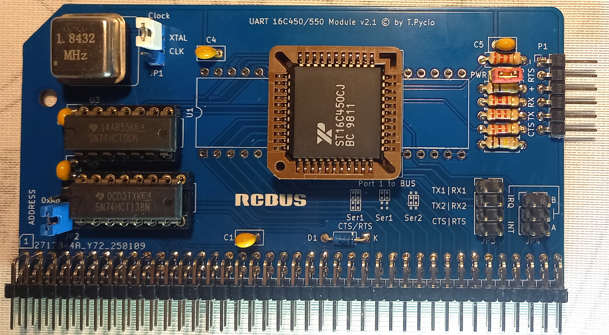

# UART 16C450/550 for RCBus

16C450/550 UART module for RCBus systems. This is a basic serial transmission module replacing existing solutions on ACIA, allowing the use of more advanced ICs with built-in FIFO and flow control automation (16C550 or later). The module allows the use of UART chips in DIP40 or PLCC44 packages.

## Hardware Documentation

### Schematic

[Schematic - Version 2.1](schematic.pdf)

### Jumpers and Connectors

#### JP1 - Clock distribution

| Position | Description     |
| -------- | --------------- |
| 1-2      | from oscillator |
| 2-3      | from bus        |

#### JP2 - UART I/O address select

| Position      | Description        |
| ------------- | ------------------ |
| 1-2 (default) | UART address: 0xA0 |
| 2-3           | UART address: 0xA8 |

#### JP3 - Link serial port to system bus

| Position                | Description                        |
| ----------------------- | ---------------------------------- |
| 1-3 & 2-4               | Bus: Serial 1                      |
| 3-5 & 4-6               | Bus: Serial 2                      |
| 1-3 & 2-4 5-7 & 6-8 | Bus: Serial 1 with  CTS/RTS signal |

#### JP4 - UART interrupt select

| Position | Description              |
| -------- | ------------------------ |
| 1-3      | /IRQ (A or B)            |
|          | add jumper 2-4 for /IRQB |
|          | add jumper 4-6 for /IRQA |
| 3-5      | /INT                     |
| open     | interrupt not use        |

#### JP5 - USB power

| Position | Description |
| -------- | ----------- |
| open     | disable     |
| close    | enable      |

External power supply and USB cannot be used at the same time!

#### JP6 - DMA channel request selection

| Position  | Description |
| --------- | ----------- |
| 1-2       | DREQ2       |
| 2-3       | DREQ1       |
| both open | disable     |

#### P1 - Serial port

Connect to USB-to-serial converter.

## Bill of Materials

| Component type     | Reference | Description                                  | Quantity |
| ------------------ | --------- | -------------------------------------------- | -------- |
| PCB                |           | UART 16C450/550 PCB - Version 2.1            | 1        |
| Integrated Circuit | U1 or U4  | 16C450 or 16C550 UART, DIP40 or PLCC44       | 1        |
| Integrated Circuit | U2        | 74HCT138 - 3-to-8 line decoder, 16 pin DIP   | 1        |
| Integrated Circuit | U3        | 74HCT00 - Quad 2-input NAND gate, 14 pin DIP | 1        |
| Oscillator         | X1        | 1.8432 MHz, CMOS oscillator, half can        | 1        |
| Diode              | D1        | Small signal Schottky diodes BAT46, DO35     | 1        |
| Connector          | S1        | 2x40 pin header, 2.54 mm pitch, angle        | 1        |
| Connector          | P1        | 6 pin header, 2.54 mm pitch, angle           | 1        |
| Pin Header         | JP1,JP2   | 3 pin header, 2.54 mm pitch                  | 2        |
| Pin Header         | JP3       | 2x4 pin header, 2.54 mm pitch                | 1        |
| Pin Header         | JP4       | 2x3 pin header, 2.54 mm pitch                | 1        |
| Pin Header         | JP5       | 3 pin header, 2.54 mm pitch                  | 1        |
| Capacitor          | C1 - C5   | 0.1 uF, 50V, MLCC, 2.5 mm pitch              | 5        |
| Resistor           | R1 - R4   | 2.2 kohm, 0.25 W, axial                      | 4        |
| Resistor           | R5,R6     | 100 kohm, 0.25 W, axial                      | 2        |
| IC Socket          | U1 or U4  | 40 pin DIP or 44 pin PLCC                    | 1        |
| IC Socket          | U2        | 16 pin DIP                                   | 1        |
| IC Socket          | U3        | 14 pin DIP                                   | 1        |
| IC Socket          | X1        | 4 pin DIP for oscillator                     | 1        |

[Gerber files](gerber-JLCPCB.zip) prepared for production at JLCPCB

## Release Notes

### Changes

* Version 2.1
  
  * Initial version

## License

Copyright 2025 Tadeusz Pycio

This work is licensed under a [Creative Commons Attribution-NonCommercial 4.0 International (CC BY-NC 4.0) ](https://creativecommons.org/licenses/by-nc/4.0/).
